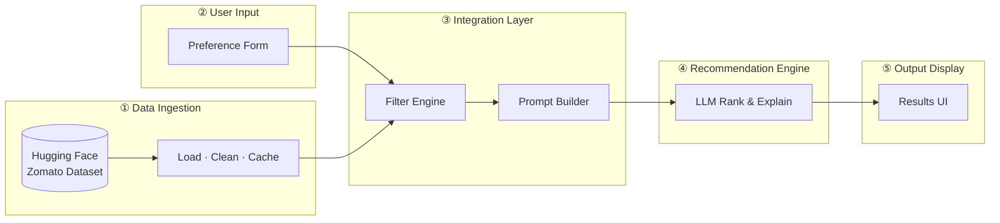
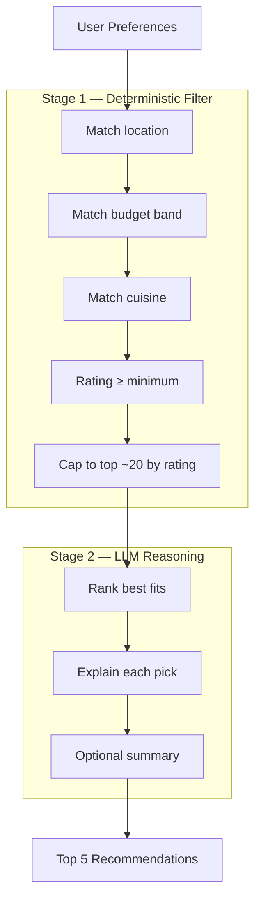
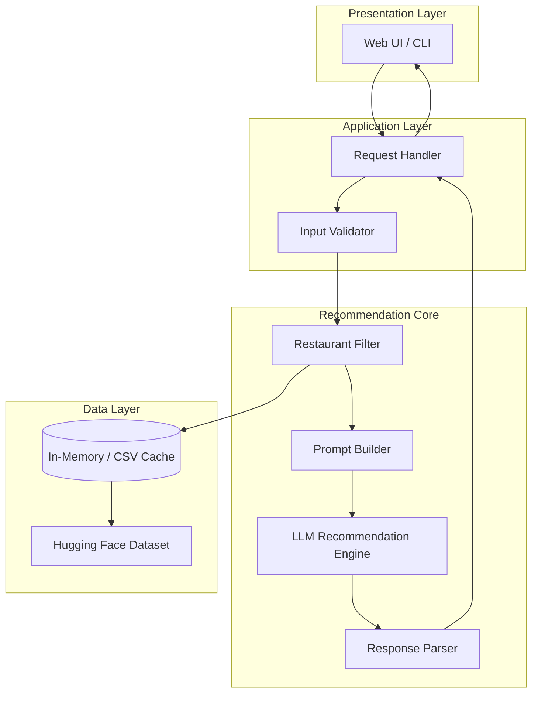
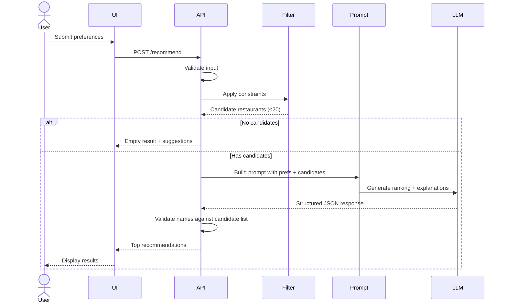

# Architecture: AI-Powered Restaurant Recommendation System

This document describes the technical architecture for building the Zomato-inspired recommendation service defined in [problemStatement.md](./problemStatement.md).

## 1. Goals & Constraints

| Goal | Architectural implication |
|------|---------------------------|
| Accept user preferences (location, budget, cuisine, rating) | Dedicated input layer with validation |
| Use real Zomato dataset from Hugging Face | Offline or cached data ingestion pipeline |
| Combine structured filtering with LLM reasoning | Two-stage pipeline: filter → rank/explain |
| Present human-friendly recommendations | Structured output schema + UI rendering |

**Design principle:** Use deterministic filtering for hard constraints (location, min rating, budget band), and the LLM for ranking, explanation, and optional summary — not as the sole source of truth for factual restaurant data.

---

## 2. High-Level Architecture

### 2.1 Overview

The system is a **layered, request-driven application** that combines a structured restaurant dataset with an LLM. At the highest level, data flows in one direction:

**User preferences → Filter real restaurants → LLM ranks & explains → Display results**

The LLM never queries the database directly. It only receives a pre-filtered list of real candidates, which keeps recommendations factual while still feeling personalized.

### 2.2 System Layers

The architecture mirrors the five stages defined in [problemStatement.md](./problemStatement.md):



| Layer | Purpose | Key outputs |
|-------|---------|-------------|
| **Data Ingestion** | Load and prepare the Zomato dataset at startup | Normalized restaurant records in memory |
| **User Input** | Capture location, budget, cuisine, rating, extras | Validated `UserPreferences` object |
| **Integration Layer** | Apply hard filters; build a grounded LLM prompt | Shortlist of candidate restaurants + prompt |
| **Recommendation Engine** | Rank candidates and write explanations | Structured JSON recommendations |
| **Output Display** | Render top picks for the user | Name, cuisine, rating, cost, explanation |

### 2.3 Two-Stage Recommendation Pipeline

Hard constraints are enforced **before** the LLM is called. Soft preferences (e.g. "family-friendly") are handled **by** the LLM during ranking.



| Stage | Handles | Does not handle |
|-------|---------|-----------------|
| **Stage 1 — Filter** | Location, budget, cuisine, min rating | Subjective preferences, tie-breaking narrative |
| **Stage 2 — LLM** | Ranking, explanations, free-text extras | Inventing restaurants or facts not in the dataset |

### 2.4 Component View

Detailed view of modules and their dependencies inside the application:



### 2.5 Technology Mapping

| Layer | Suggested technology |
|-------|----------------------|
| Data Ingestion | `datasets`, `pandas` |
| User Input & Output Display | Streamlit (MVP) or React |
| Application / Integration | FastAPI or Streamlit session |
| Recommendation Engine | OpenAI / Groq / Ollama via `LLMClient` |
| Config & secrets | `.env` + `python-dotenv` |

---

## 3. Component Breakdown

Each component maps directly to a section in the problem statement.

### 3.1 Data Ingestion

**Responsibility:** Load, clean, and normalize the Zomato dataset once at startup (or on a schedule).

| Step | Action |
|------|--------|
| Load | Fetch dataset via `datasets.load_dataset("ManikaSaini/zomato-restaurant-recommendation")` |
| Extract | Keep: name, location/city, cuisines, cost for two, aggregate rating, optional flags |
| Normalize | Standardize city names, parse cuisines (comma-separated → list), map cost to budget bands |
| Cache | Store as pandas DataFrame or Parquet for fast filtering |

**Budget band mapping (example):**

| Band | Cost for two (INR) |
|------|---------------------|
| low | ≤ 500 |
| medium | 501 – 1500 |
| high | > 1500 |

> Adjust thresholds after inspecting actual dataset distribution.

### 3.2 User Input

**Responsibility:** Collect and validate preferences before hitting the recommendation pipeline.

**Input schema:**

```python
UserPreferences:
  location: str          # e.g. "Bangalore"
  budget: Literal["low", "medium", "high"]
  cuisine: str           # e.g. "Italian"
  min_rating: float      # e.g. 4.0
  extra_preferences: str # free text, e.g. "family-friendly, quick service"
```

Validation rules:
- `location` must match a known city in the dataset (fuzzy match optional)
- `min_rating` in range 0.0 – 5.0
- `cuisine` checked against available cuisines for that location (with fallback suggestions)

### 3.3 Integration Layer

**Responsibility:** Bridge structured data and the LLM.

1. **Filter** restaurants matching hard constraints:
   - City = user location
   - Rating ≥ min_rating
   - Cost band matches budget
   - Cuisine contains requested type (case-insensitive)

2. **Cap candidates** (e.g. top 20 by rating) to keep prompts within token limits.

3. **Serialize** filtered rows into a compact JSON/text block for the prompt.

4. **Build prompt** with:
   - System role: restaurant recommendation assistant
   - User preferences (structured + free-text extras)
   - Candidate restaurant list (facts only — no hallucination)
   - Output format instructions (JSON schema)

### 3.4 Recommendation Engine (LLM)

**Responsibility:** Rank candidates and generate explanations.

The LLM should **only** choose from the provided candidate list. Prompt must explicitly forbid inventing restaurants.

**LLM tasks:**

| Task | Required |
|------|----------|
| Rank top N restaurants (e.g. 5) | Yes |
| Explain why each fits user preferences | Yes |
| Optional one-line summary of overall picks | Optional |

**Suggested output schema:**

```json
{
  "summary": "Three strong Italian options in Bangalore under medium budget.",
  "recommendations": [
    {
      "rank": 1,
      "restaurant_name": "Example Bistro",
      "cuisine": "Italian, Continental",
      "rating": 4.5,
      "estimated_cost": 800,
      "explanation": "Matches your Italian preference, highly rated, and fits medium budget."
    }
  ]
}
```

**LLM provider options:**

| Provider | Use case |
|----------|----------|
| OpenAI / Groq / Anthropic API | Production-quality responses, low latency |
| Ollama (local) | Offline development, no API cost |

Wrap the LLM behind an interface so the provider can be swapped via environment config.

### 3.5 Output Display

**Responsibility:** Render recommendations in a clear, scannable format.

Each card/row shows:
- Restaurant Name
- Cuisine
- Rating
- Estimated Cost
- AI-generated explanation

Handle edge cases in the UI:
- **No matches after filtering** → suggest relaxing budget or rating
- **LLM parse failure** → fall back to rating-sorted list without explanations
- **Loading state** while LLM responds

---

## 4. Request Flow (Sequence)



---

## 5. Recommended Tech Stack

| Layer | Technology | Rationale |
|-------|------------|-----------|
| Language | Python 3.11+ | Strong ML/data ecosystem, Hugging Face support |
| Data loading | `datasets`, `pandas` | Native Hugging Face integration |
| API (optional) | FastAPI | Lightweight, async, auto OpenAPI docs |
| UI (recommended for demo) | Streamlit | Fast to build forms + result cards |
| UI (alternative) | React + FastAPI | Separated frontend if you need a custom UI |
| LLM | OpenAI GPT-4o-mini / Groq Llama | Cost-effective for structured output |
| Config | `python-dotenv` | API keys via environment variables |
| Validation | Pydantic | Type-safe request/response models |

---

## 6. Project Structure

```
zomato_ai/
├── docs/
│   ├── problemStatement.md
│   └── architecture.md
├── src/
│   ├── __init__.py
│   ├── main.py                 # Streamlit entry OR FastAPI app
│   ├── config.py               # Env vars, budget thresholds
│   ├── data/
│   │   ├── loader.py           # Hugging Face load + cache
│   │   └── preprocessor.py     # Normalize fields, budget bands
│   ├── models/
│   │   ├── preferences.py      # UserPreferences schema
│   │   └── recommendation.py   # Recommendation response schema
│   ├── services/
│   │   ├── filter.py           # Deterministic restaurant filtering
│   │   ├── prompt.py           # Prompt templates
│   │   ├── llm.py              # LLM client abstraction
│   │   └── recommender.py      # Orchestrates filter → LLM → parse
│   └── ui/
│       └── components.py       # Streamlit form + result cards
├── tests/
│   ├── test_filter.py
│   └── test_prompt.py
├── .env.example
├── requirements.txt
└── README.md
```

---

## 7. Key Interfaces

### 7.1 Recommender (orchestrator)

```python
def get_recommendations(prefs: UserPreferences, top_n: int = 5) -> RecommendationResponse:
    candidates = filter_restaurants(dataframe, prefs)
    if candidates.empty:
        return RecommendationResponse.empty_with_suggestions(prefs)
    prompt = build_recommendation_prompt(prefs, candidates)
    raw = llm_client.complete(prompt)
    return parse_and_validate(raw, candidates, top_n)
```

### 7.2 Filter service

```python
def filter_restaurants(df: pd.DataFrame, prefs: UserPreferences) -> pd.DataFrame:
    # location + rating + budget + cuisine
    ...
```

### 7.3 LLM client (provider-agnostic)

```python
class LLMClient(Protocol):
    def complete(self, messages: list[dict], response_format: str = "json") -> str: ...
```

---

## 8. Prompt Design Guidelines

1. **Grounding:** Include explicit instruction: *"Recommend ONLY from the provided list. Do not invent restaurants."*
2. **Structured output:** Request JSON matching `RecommendationResponse` schema; use JSON mode if the provider supports it.
3. **Context:** Pass user `extra_preferences` as natural language the LLM can weigh against candidate attributes.
4. **Ranking criteria:** Instruct the model to prioritize, in order: cuisine match → rating → budget fit → extra preferences.
5. **Brevity:** Keep explanations to 1–2 sentences per restaurant.

---

## 9. Non-Functional Requirements

| Concern | Approach |
|---------|----------|
| **Latency** | Cache dataset in memory; limit candidates to ~20; use a fast LLM model |
| **Cost** | Filter before LLM call; use smaller models; cache identical queries (optional) |
| **Reliability** | Validate LLM output against candidate names; retry once on parse failure |
| **Security** | Never commit API keys; load from `.env` |
| **Observability** | Log filter counts, prompt token size, LLM latency (basic logging suffices for MVP) |

---

## 10. Implementation Phases

| Phase | Deliverable |
|-------|-------------|
| **Phase 1 — Data** | Load Hugging Face dataset, preprocess, expose filter function |
| **Phase 2 — Filter MVP** | CLI that accepts preferences and prints top-rated matches (no LLM) |
| **Phase 3 — LLM integration** | Prompt builder, LLM client, JSON parser, hallucination guard |
| **Phase 4 — UI** | Streamlit app: form → recommendations with explanations |
| **Phase 5 — Polish** | Error handling, empty states, README, optional FastAPI endpoint |

---

## 11. API Endpoint (Optional)

If exposing a REST API instead of (or in addition to) Streamlit:

```
POST /api/v1/recommend
Content-Type: application/json

Request:
{
  "location": "Bangalore",
  "budget": "medium",
  "cuisine": "Italian",
  "min_rating": 4.0,
  "extra_preferences": "family-friendly"
}

Response 200:
{
  "summary": "...",
  "recommendations": [ ... ]
}

Response 422: validation error
Response 200 (empty): { "recommendations": [], "suggestions": ["Try lowering min_rating to 3.5"] }
```

---

## 12. Risks & Mitigations

| Risk | Mitigation |
|------|------------|
| LLM hallucinates restaurants | Post-validate every name against filtered candidate set |
| Dataset field names differ from docs | Inspect schema on first load; map columns in preprocessor |
| Sparse matches for strict filters | Return helpful empty-state messages; suggest relaxed criteria |
| Token limit exceeded | Cap candidates; send only essential fields per restaurant |
| API rate limits / cost | Use local Ollama for dev; batch or cache in production |

---

## 13. Success Criteria

The implementation satisfies the problem statement when:

- [ ] User can submit location, budget, cuisine, min rating, and extra preferences
- [ ] Recommendations are sourced from the Hugging Face Zomato dataset
- [ ] Results include name, cuisine, rating, estimated cost, and AI explanation
- [ ] LLM ranks and explains — not the only filter — preserving factual accuracy
- [ ] Output is readable and actionable in the UI
