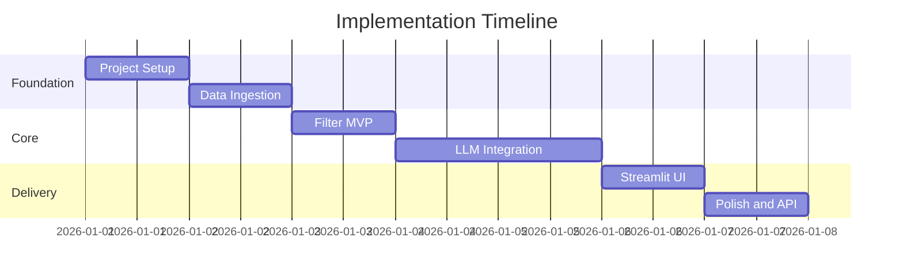
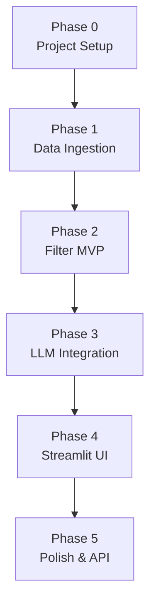

# Implementation Plan: AI-Powered Restaurant Recommendation System

Phase-wise build plan derived from [problemStatement.md](./problemStatement.md) and [architecture.md](./architecture.md).

## Overview

| Phase | Name | Focus | Est. effort |
|-------|------|-------|-------------|
| 0 | Project Setup | Repo, dependencies, config | 0.5 day |
| 1 | Data Ingestion | Load & preprocess Hugging Face dataset | 1 day |
| 2 | Filter MVP | Deterministic filtering (no LLM) | 1 day |
| 3 | LLM Integration | Prompt, rank, explain, parse | 1.5 days |
| 4 | UI | Streamlit form + result display | 1 day |
| 5 | Polish & Optional API | Errors, tests, docs, FastAPI | 1 day |

**Total estimate:** ~6 days for a working MVP.



---

## Phase 0 — Project Setup

**Maps to:** Architecture §5 (Tech Stack), §6 (Project Structure)

### Goals

- Bootstrap the repository with a consistent folder layout
- Pin dependencies and environment configuration
- Enable local development without committing secrets

### Tasks

| # | Task | Output |
|---|------|--------|
| 0.1 | Create `src/` package structure per architecture | Folders: `data/`, `models/`, `services/`, `ui/` |
| 0.2 | Add `requirements.txt` | `pandas`, `datasets`, `pydantic`, `python-dotenv`, `streamlit`, LLM SDK |
| 0.3 | Add `.env.example` | `OPENAI_API_KEY`, `LLM_PROVIDER`, budget threshold vars |
| 0.4 | Implement `src/config.py` | Load env vars; define budget band thresholds |
| 0.5 | Add `.gitignore` | `.env`, `__pycache__`, `.venv`, cached data |
| 0.6 | Scaffold `README.md` | Setup steps, how to run, env var table |

### Deliverables

```
zomato_ai/
├── src/
│   ├── __init__.py
│   ├── config.py
│   └── main.py          # placeholder
├── requirements.txt
├── .env.example
├── .gitignore
└── README.md
```

### Acceptance criteria

- [ ] `python -m venv .venv && pip install -r requirements.txt` succeeds
- [ ] `config.py` reads values from `.env` with sensible defaults
- [ ] No secrets committed to the repo

### Dependencies

None — start here.

---

## Phase 1 — Data Ingestion

**Maps to:** Problem Statement → *Data Ingestion* · Architecture §3.1

### Goals

- Load the [Zomato dataset](https://huggingface.co/datasets/ManikaSaini/zomato-restaurant-recommendation) from Hugging Face
- Extract and normalize fields needed for filtering and display
- Cache data in memory for fast lookups at runtime

### Tasks

| # | Task | Output |
|---|------|--------|
| 1.1 | Implement `src/data/loader.py` | `load_restaurants()` using `datasets.load_dataset(...)` |
| 1.2 | Inspect raw schema on first run | Document actual column names in code comments |
| 1.3 | Implement `src/data/preprocessor.py` | Normalize city, cuisines, cost, rating |
| 1.4 | Map cost → budget band (`low` / `medium` / `high`) | Configurable thresholds in `config.py` |
| 1.5 | Add `@st.cache_data` or module-level singleton | Dataset loaded once per app session |
| 1.6 | Write exploratory script or notebook cell | Print row count, cities, cuisine samples |

### Key fields to extract

| Field | Use |
|-------|-----|
| Restaurant name | Display + LLM grounding |
| Location / city | Hard filter |
| Cuisines | Hard filter + display |
| Cost for two | Budget band + display |
| Aggregate rating | Hard filter + ranking tie-break |

### Deliverables

- `src/data/loader.py`
- `src/data/preprocessor.py`
- Function: `get_restaurant_dataframe() -> pd.DataFrame`

### Acceptance criteria

- [ ] Dataset loads without manual download steps
- [ ] DataFrame has normalized columns: `name`, `city`, `cuisines`, `cost_for_two`, `rating`, `budget_band`
- [ ] Budget bands assigned correctly per configured thresholds
- [ ] Load time acceptable (< 30s on first run; cached afterward)

### Dependencies

Phase 0 complete.

---

## Phase 2 — Filter MVP (No LLM)

**Maps to:** Problem Statement → *User Input*, *Integration Layer* (filter half) · Architecture §3.2, §3.3 (Stage 1)

### Goals

- Define typed user preference models
- Implement deterministic filtering for all hard constraints
- Prove the pipeline works end-to-end via CLI before adding LLM complexity

### Tasks

| # | Task | Output |
|---|------|--------|
| 2.1 | Create `src/models/preferences.py` | Pydantic `UserPreferences` model |
| 2.2 | Add validation rules | City in dataset, rating 0–5, budget enum |
| 2.3 | Implement `src/services/filter.py` | `filter_restaurants(df, prefs)` |
| 2.4 | Apply filters: location → rating → budget → cuisine | Chained pandas filters |
| 2.5 | Cap results to top 20 by rating | `head(20)` after sort |
| 2.6 | Add empty-result helper | Suggestions to relax rating or budget |
| 2.7 | Build CLI in `src/main.py` | Accept args or stdin; print table |

### `UserPreferences` schema

```python
location: str
budget: Literal["low", "medium", "high"]
cuisine: str
min_rating: float
extra_preferences: str = ""
```

### Deliverables

- `src/models/preferences.py`
- `src/services/filter.py`
- CLI: `python -m src.main --location Bangalore --budget medium --cuisine Italian --min-rating 4.0`

### Acceptance criteria

- [ ] Invalid location returns a clear validation error
- [ ] Filter returns only restaurants matching all hard constraints
- [ ] Results sorted by rating descending, capped at 20
- [ ] Empty filter result includes actionable suggestions
- [ ] CLI prints name, cuisine, rating, cost for each match

### Dependencies

Phase 1 complete.

### Example test cases

| Input | Expected |
|-------|----------|
| Bangalore + Italian + medium + 4.0 | Non-empty list, all Italian, rating ≥ 4.0 |
| Invalid city "Paris" | Validation error |
| Very strict filters (5.0 rating + low budget) | Empty list + suggestions |

---

## Phase 3 — LLM Integration

**Maps to:** Problem Statement → *Integration Layer* (prompt), *Recommendation Engine* · Architecture §3.3, §3.4, §7, §8

### Goals

- Build grounded prompts from filtered candidates
- Call an LLM to rank, explain, and optionally summarize
- Parse and validate JSON output; guard against hallucinations

### Tasks

| # | Task | Output |
|---|------|--------|
| 3.1 | Create `src/models/recommendation.py` | `Recommendation`, `RecommendationResponse` |
| 3.2 | Implement `src/services/prompt.py` | `build_recommendation_prompt(prefs, candidates)` |
| 3.3 | Implement `src/services/llm.py` | Provider-agnostic `LLMClient` (OpenAI / Groq / Ollama) |
| 3.4 | Implement `src/services/recommender.py` | Orchestrator: filter → prompt → LLM → parse |
| 3.5 | Add JSON parse + retry logic | Retry once on malformed response |
| 3.6 | Add hallucination guard | Drop/reject restaurants not in candidate list |
| 3.7 | Add fallback path | Rating-sorted list without explanations if LLM fails |
| 3.8 | Write `tests/test_prompt.py` | Prompt contains all candidate names |
| 3.9 | Write `tests/test_filter.py` | Unit tests for filter edge cases |

### Prompt requirements (from architecture)

1. Instruct: *"Recommend ONLY from the provided list."*
2. Include structured preferences + free-text extras
3. Request JSON matching `RecommendationResponse` schema
4. Ranking priority: cuisine match → rating → budget → extras

### Deliverables

- `src/models/recommendation.py`
- `src/services/prompt.py`
- `src/services/llm.py`
- `src/services/recommender.py`
- `get_recommendations(prefs, top_n=5) -> RecommendationResponse`

### Acceptance criteria

- [x] LLM returns valid JSON with `recommendations` array
- [x] Every `restaurant_name` in output exists in the filtered candidate set
- [x] Each recommendation includes: name, cuisine, rating, cost, explanation
- [x] Optional `summary` field populated when model supports it
- [x] LLM failure falls back to rating-sorted results (no crash)
- [x] Provider swappable via `LLM_PROVIDER` env var

### Dependencies

Phase 2 complete · LLM API key or local Ollama running.

---

## Phase 4 — UI (Streamlit)

**Maps to:** Problem Statement → *User Input*, *Output Display* · Architecture §3.2, §3.5

### Goals

- Provide a user-friendly web interface for submitting preferences
- Display top recommendations with all required fields
- Handle loading, empty, and error states

### Tasks

| # | Task | Output |
|---|------|--------|
| 4.1 | Refactor `src/main.py` as Streamlit entry | `streamlit run src/main.py` |
| 4.2 | Create `src/ui/components.py` | `render_preference_form()`, `render_recommendations()` |
| 4.3 | Build preference form | Location dropdown, budget select, cuisine input, rating slider, extras textarea |
| 4.4 | Populate location/cuisine dropdowns from dataset | Dynamic options per loaded data |
| 4.5 | Wire form submit → `get_recommendations()` | Show spinner during LLM call |
| 4.6 | Render result cards | Name, cuisine, rating, cost, explanation per card |
| 4.7 | Render summary banner | Optional one-line LLM summary at top |
| 4.8 | Handle empty results | Friendly message + suggestion chips |
| 4.9 | Handle LLM errors | User-visible message + fallback list |

### UI wireframe (logical layout)

```
┌─────────────────────────────────────────┐
│  🍽️ Zomato AI Recommendations           │
├─────────────────────────────────────────┤
│  Location [dropdown]  Budget [select]   │
│  Cuisine  [input]     Min Rating [slider]│
│  Extra preferences [textarea]           │
│  [ Get Recommendations ]                │
├─────────────────────────────────────────┤
│  Summary: "Three great Italian spots…"  │
│  ┌─────────────────────────────────┐    │
│  │ #1 Restaurant Name    ⭐ 4.5    │    │
│  │ Italian · ₹800 for two          │    │
│  │ "Matches your Italian preference…"│   │
│  └─────────────────────────────────┘    │
│  (repeat for top 5)                     │
└─────────────────────────────────────────┘
```

### Deliverables

- `src/main.py` (Streamlit app)
- `src/ui/components.py`

### Acceptance criteria

- [ ] User can submit all five preference types from the problem statement
- [ ] Results show: name, cuisine, rating, estimated cost, AI explanation
- [ ] Loading indicator visible during LLM request
- [ ] Empty and error states handled gracefully
- [ ] App runs with single command: `streamlit run src/main.py`

### Dependencies

Phase 3 complete.

---

## Phase 5 — Polish & Optional API

**Maps to:** Architecture §9 (Non-Functional), §11 (API), §12 (Risks), §13 (Success Criteria)

### Goals

- Harden error handling, logging, and edge cases
- Document the project for others to run
- Optionally expose a REST API for programmatic access

### Tasks

| # | Task | Output |
|---|------|--------|
| 5.1 | Add structured logging | Filter count, LLM latency, parse failures |
| 5.2 | Expand `README.md` | Architecture diagram link, demo screenshots, troubleshooting |
| 5.3 | Finalize `tests/` | Filter + prompt tests pass via `pytest` |
| 5.4 | Review `.env.example` | All required vars documented |
| 5.5 | *(Optional)* Add FastAPI router | `POST /api/v1/recommend` |
| 5.6 | *(Optional)* Add request/response OpenAPI docs | Auto-generated at `/docs` |
| 5.7 | Manual QA pass | Run through success criteria checklist |
| 5.8 | Tag release / demo video | Optional for submission or portfolio |

### Optional FastAPI endpoint

```
POST /api/v1/recommend
→ Same UserPreferences body
→ Same RecommendationResponse body
```

### Deliverables

- Updated `README.md`
- Passing test suite
- *(Optional)* `src/api/router.py` + uvicorn entry

### Acceptance criteria

- [ ] All items in **Final success checklist** (below) are checked
- [ ] `pytest tests/` passes
- [ ] README allows a new developer to run the app in < 10 minutes
- [ ] *(Optional)* API returns same results as Streamlit for identical input

### Dependencies

Phase 4 complete.

---

## Phase Dependency Graph



Each phase builds on the previous one. **Do not skip Phase 2** — validating filters without the LLM makes Phase 3 debugging much easier.

---

## Final Success Checklist

Aligned with [problemStatement.md](./problemStatement.md) objectives and [architecture.md](./architecture.md) §13:

- [ ] User can submit location, budget, cuisine, minimum rating, and extra preferences
- [ ] Recommendations come from the Hugging Face Zomato dataset (not invented)
- [ ] Hard filters applied before LLM call (location, budget, cuisine, rating)
- [ ] LLM ranks restaurants and provides explanations
- [ ] Optional summary of overall picks displayed
- [ ] Each result shows: restaurant name, cuisine, rating, estimated cost, AI explanation
- [ ] Empty results suggest relaxing constraints
- [ ] LLM output validated against candidate list (no hallucinations)
- [ ] API keys stored in `.env`, not in source code

---

## Risk Register (by phase)

| Phase | Risk | Mitigation |
|-------|------|------------|
| 1 | Dataset columns differ from expected | Inspect schema first; map in preprocessor |
| 1 | Slow first load | Cache DataFrame; optional Parquet export |
| 2 | Over-strict filters → no results | Empty-state suggestions; log filter counts |
| 3 | LLM hallucinates restaurants | Post-validate names against candidates |
| 3 | JSON parse failures | Retry once; fallback to rating sort |
| 3 | API cost / rate limits | Use Ollama locally; cap candidates to 20 |
| 4 | Poor UX on slow LLM | Spinner + timeout message |
| 5 | Incomplete docs | Follow README template in Phase 0 |

---

## Suggested Commands (Quick Reference)

```bash
# Setup
python -m venv .venv
.venv\Scripts\activate        # Windows
pip install -r requirements.txt
copy .env.example .env        # add your API key

# Phase 2 — CLI filter test
python -m src.main --location Bangalore --budget medium --cuisine Italian --min-rating 4.0

# Phase 4 — Run app
streamlit run src/main.py

# Phase 5 — Tests
pytest tests/ -v

# Phase 5 — Optional API
uvicorn src.api.app:app --reload
```

---

## Document Links

| Document | Purpose |
|----------|---------|
| [problemStatement.md](./problemStatement.md) | *What* to build |
| [architecture.md](./architecture.md) | *How* to structure it |
| **implementation_plan.md** | *When* and in *what order* to build it |
